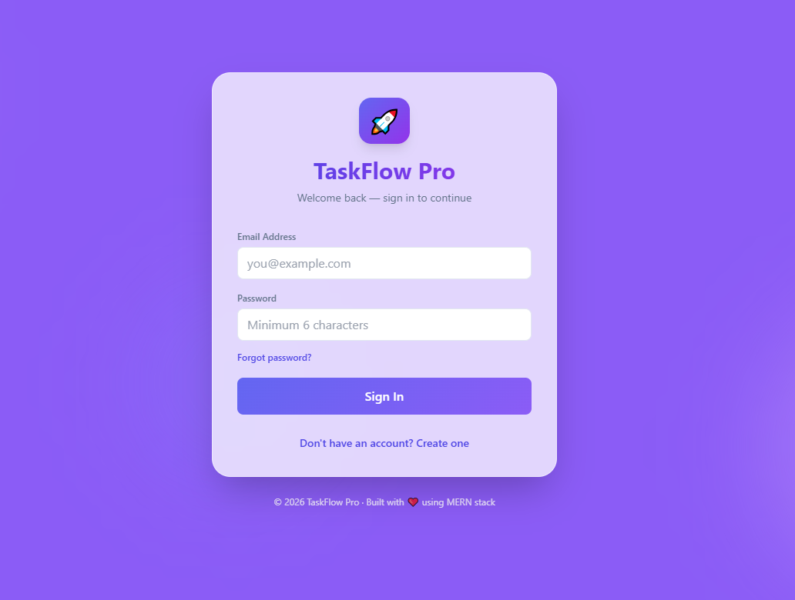
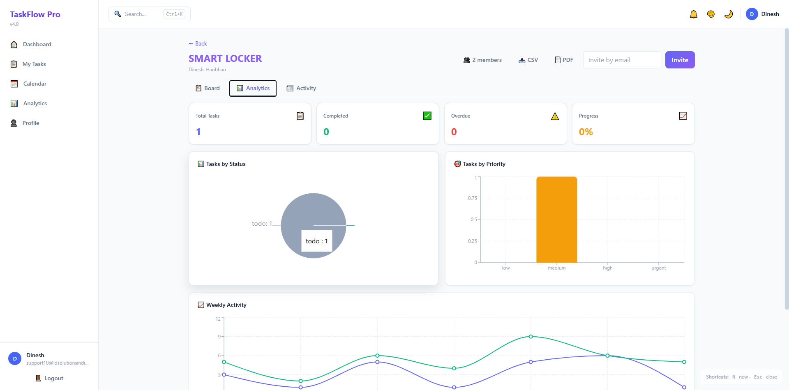
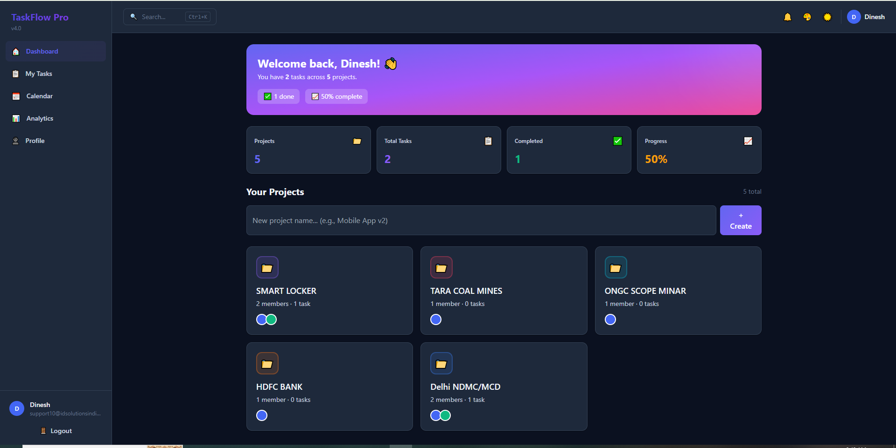

# 🚀 CodaAlpha — Project Management Tool

### A modern, collaborative project management platform built with MERN stack + Real-time WebSockets

**[Live Demo](#) · [Features](#-features) · [Screenshots](#-screenshots) · [Setup](#-local-setup)**

---

## 📖 About The Project

**CodaAlpha** is a full-stack collaborative project management tool inspired by Trello and Asana. It enables teams to organize work on visual boards, assign tasks, communicate in real-time, track progress with analytics, and stay updated with notifications.

Built with a **modern tech stack** featuring JWT authentication, Socket.IO real-time updates, role-based access control, and beautiful glassmorphism UI with dark mode support.

---

## ✨ Features

### 🔐 Authentication & Security
- JWT-based authentication with bcrypt password hashing
- Forgot password with **email OTP** verification
- Email alerts on password change (security notifications)
- Role-based access control (Owner / Admin / Member / Viewer)

### 📋 Project Management
- Create unlimited projects with custom colors & emoji icons
- Invite team members via email
- Role management per project
- Member avatars with colored initials

### ✅ Task Management
- Kanban board with **drag & drop** (4 columns: To Do, In Progress, Review, Done)
- Task cards with priority (Low / Medium / High / Urgent)
- Due dates with **overdue warnings**
- Assign tasks to team members
- Labels / tags for categorization
- **Subtasks** with progress bar
- **File attachments** with image preview
- **Time tracking** (estimated vs logged hours)
- **Pomodoro timer** for focused work

### 💬 Collaboration
- Comments with **@mentions**
- Real-time updates via **Socket.IO** (no refresh needed)
- Activity feed (audit log of every action)
- Notification center with sound + browser push

### 📊 Analytics & Insights
- Project dashboard with real-time stats
- Pie chart (tasks by status)
- Bar chart (tasks by priority)
- Line chart (weekly activity)
- Global analytics across all projects
- **Export project as CSV / PDF**

### 🎨 UI/UX
- Beautiful **glassmorphism design**
- Dark / Light mode toggle (persisted)
- **6 accent color themes**
- Fully responsive (mobile + tablet + desktop)
- Toast notifications
- Keyboard shortcuts (`N` for new task, `Esc` to close, `Ctrl+K` for search)
- Global search across projects & tasks

### 📧 Email Notifications
- OTP for password reset
- Task assignment alerts
- Task completion alerts
- Password change security alerts
- Beautiful branded HTML email templates

### 🎁 Bonus
- **Saved Views** — save filter combinations
- **Calendar view** — tasks by due date
- **My Tasks page** — all your assigned tasks in one place
- **PWA-ready** (installable as mobile app)

---

## 🖼 Screenshots

### 🔐 Login Page

### 📊 Dashboard with Analytics

### 📋 Kanban Board (Drag & Drop)

### 🎯 Task Detail Modal

### 📈 Analytics Panel

### 🌙 Dark Mode

### 🆕 Create Account

### 🔑 Forgot Password (OTP)

---

## 🛠 Tech Stack

### Frontend
| Tech | Purpose |
|---|---|
| **React 18** | UI library |
| **Vite** | Build tool + dev server |
| **React Router v6** | Client-side routing |
| **TailwindCSS** | Styling + responsive design |
| **@dnd-kit** | Drag & drop for Kanban |
| **Recharts** | Analytics charts |
| **Socket.IO Client** | Real-time updates |
| **Axios** | HTTP client |
| **jsPDF** | PDF export |

### Backend
| Tech | Purpose |
|---|---|
| **Node.js** | Runtime |
| **Express 5** | Web framework |
| **Prisma** | ORM + migrations |
| **Socket.IO** | WebSocket server |
| **JWT** | Authentication |
| **bcryptjs** | Password hashing |
| **Multer** | File uploads |
| **Nodemailer** | Email sending |

### Database
- **SQLite** (development)
- **PostgreSQL** (production-ready with Neon)

---

## 📁 Project Structure
